# Entity Relationship Diagram

```mermaid
erDiagram
  PLANTS ||--o{ AREAS : contains
  PLANTS ||--o{ MACHINES : owns
  PLANTS ||--o{ ROBOTS : owns
  PLANTS ||--o{ STORAGE_LOCATIONS : contains
  MACHINES ||--o{ MACHINE_ROBOT_ASSIGNMENTS : has
  ROBOTS ||--o{ MACHINE_ROBOT_ASSIGNMENTS : assigned
  TOOLS ||--o{ TOOL_PARTS : produces
  PARTS ||--o{ TOOL_PARTS : produced_by
  EOATS ||--o{ EOAT_MACHINE_COMPATIBILITY : evaluated
  MACHINES ||--o{ EOAT_MACHINE_COMPATIBILITY : evaluated
  EOATS ||--o{ EOAT_TOOL_COMPATIBILITY : evaluated
  TOOLS ||--o{ EOAT_TOOL_COMPATIBILITY : evaluated
  TOOLS ||--o{ TOOL_MACHINE_COMPATIBILITY : evaluated
  MACHINES ||--o{ TOOL_MACHINE_COMPATIBILITY : evaluated
  EOATS ||--o{ EOAT_INSTALLATIONS : installed
  MACHINES ||--o{ EOAT_INSTALLATIONS : hosts
  EOATS ||--o{ EOAT_STORAGE_ASSIGNMENTS : stored
  STORAGE_LOCATIONS ||--o{ EOAT_STORAGE_ASSIGNMENTS : holds
  DOCUMENTS ||--o| PHOTOS : specializes
  DOCUMENTS ||--o{ DOCUMENT_LINKS : relates
  IMPORT_BATCHES ||--o{ IMPORT_ROWS : contains
  IMPORT_BATCHES ||--o{ IMPORT_ISSUES : reports
  USERS ||--o{ USER_ROLES : receives
  ROLES ||--o{ USER_ROLES : grants
  TAGS ||--o{ ENTITY_TAGS : assigned
  ANNOTATION_TARGETS ||--o{ ENTITY_TAGS : legacy_target
  ANNOTATIONS ||--o{ ANNOTATION_TARGET_LINKS : links
  ANNOTATION_TARGETS ||--o{ ANNOTATION_TARGET_LINKS : receives
  EOATS ||--o{ MAINTENANCE_EVENTS : maintained
  MACHINES ||--o{ MAINTENANCE_EVENTS : maintained
  USERS ||--o{ IDEMPOTENCY_RECORDS : owns
```

Polymorphic history, audit, change-feed and document-link entity references are intentionally not drawn as false database foreign keys; their target existence is a server-service invariant.
